# Hi, I'm Danilo Nunes 👋

  I am a developer from <strong>Brazil</strong> who enjoys building web products, real-time experiences, and practical automation tools.

## About me

- 🌎 Based in Nova Serrana, Minas Gerais, Brazil.
- 🧩 Interested in full-stack web development, games, integrations, and developer tooling.
- 🌱 Always learning and turning new ideas into projects.
- 🤝 Open to connecting and collaborating through [GitHub](https://github.com/DanniloSN).

## Tech stack

  
  
  
  
  
  
  
  
  
  
  
  
  
  

## Featured projects

<table>
  <tr>
    <td width="50%" valign="top">
      <h3 align="center">Ping Hub</h3>
      
A full-stack hub built with SvelteKit, TypeScript, Prisma, Docker, and integration APIs.

      
<a href="https://github.com/DanniloSN/ping-hub">View repository →</a>

    </td>
    <td width="50%" valign="top">
      <h3 align="center">Sword Spinner</h3>
      
A fast-paced real-time multiplayer arena game powered by Node.js, Express, and Socket.IO.

      
<a href="https://github.com/DanniloSN/sword-spinner">View repository →</a>

    </td>
  </tr>
  <tr>
    <td width="50%" valign="top">
      <h3 align="center">Hiragana & Katakana Quiz</h3>
      
An interactive browser quiz for practicing Japanese writing systems.

      
<a href="https://github.com/DanniloSN/hiragana-katakana-quiz">Repository</a> · <a href="https://dannilosn.github.io/hiragana-katakana-quiz/">Live demo</a>

    </td>
    <td width="50%" valign="top">
      <h3 align="center">Kanji Wallpaper Generator</h3>
      
A lightweight web tool to create dynamic wallpapers with Japanese kanji.

      
<a href="https://github.com/DanniloSN/kanji-dynamic-wallpaper-generator">Repository</a> · <a href="https://dannilosn.github.io/kanji-dynamic-wallpaper-generator/">Live demo</a>

    </td>
  </tr>
  <tr>
    <td width="50%" valign="top">
      <h3 align="center">Rclone Cron S3</h3>
      
A Docker image that schedules automated folder synchronization to Amazon S3.

      
<a href="https://github.com/DanniloSN/rclone-cron-s3">View repository →</a>

    </td>
    <td width="50%" valign="top">
      <h3 align="center">Postgres Cron Backup</h3>
      
A Docker-based solution for scheduled PostgreSQL backups with retention controls.

      
<a href="https://github.com/DanniloSN/postgres-cron-backup">View repository →</a>

    </td>
  </tr>
</table>

## GitHub activity

  
  

## Contribution graph

<picture>
  <source media="(prefers-color-scheme: dark)" srcset="https://raw.githubusercontent.com/DanniloSN/DanniloSN/output/github-contribution-grid-snake-dark.svg" />
  <source media="(prefers-color-scheme: light)" srcset="https://raw.githubusercontent.com/DanniloSN/DanniloSN/output/github-contribution-grid-snake.svg" />
  
</picture>

Thanks for visiting — feel free to explore my repositories and connect!

